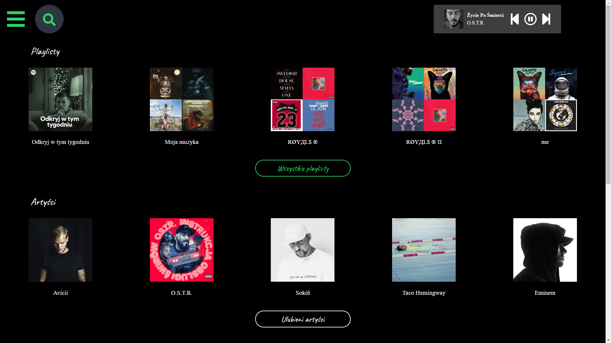
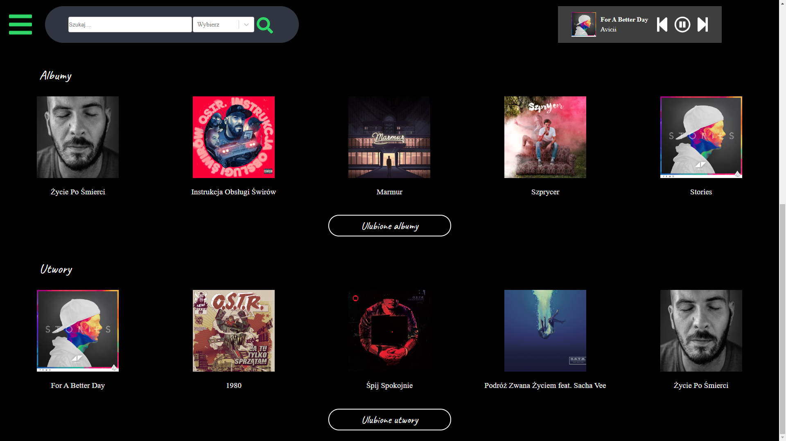
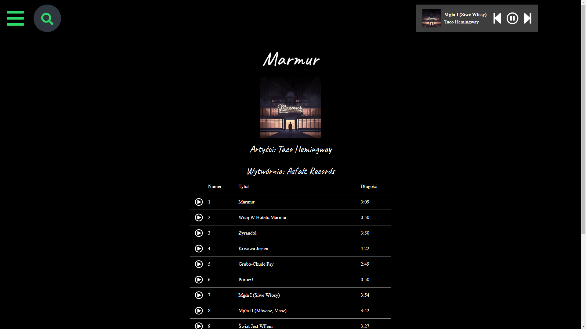
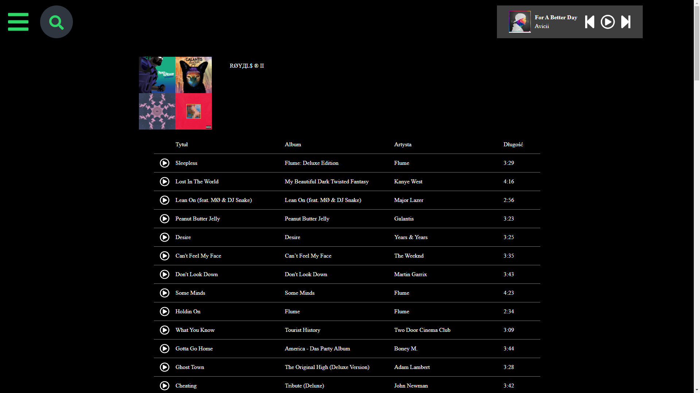
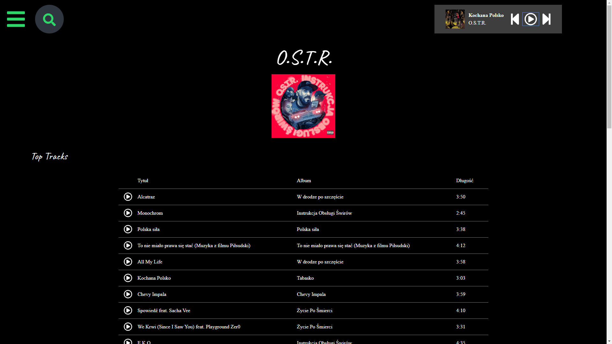
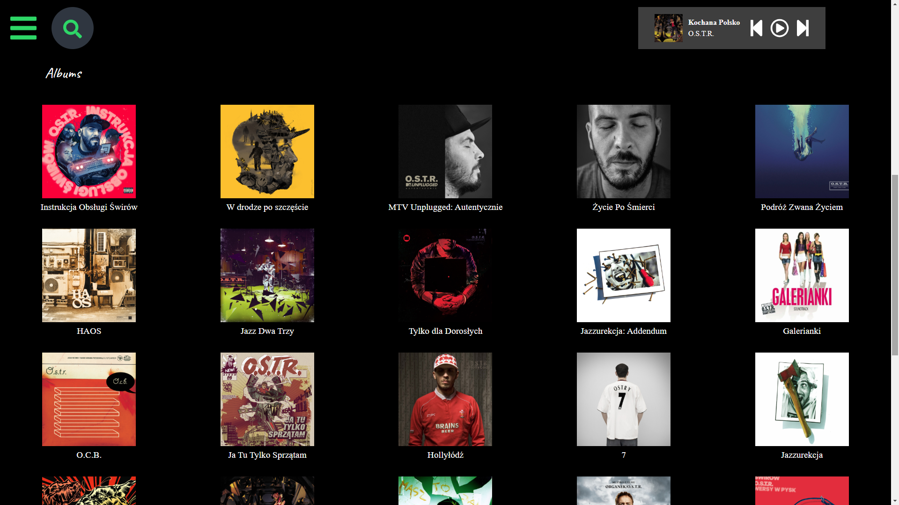

# Music-React-Redux-Spotyify_API

## 1. General info
This project aims to develop my skills in the field of React and Redux. In the project Spotify Web API (https://developer.spotify.com/documentation/web-api/) was used. This project allows, using a Spotify account, to play music, search informations, browse individual artists, playlists and songs.
## 2. Setup
 1. Clone or download repository
 2. Login in https://developer.spotify.com/dashboard/login and add new project. You will get Client_id. Please copy it.
 3. Open file ./src/apis/env.js and paste Client id to first variable.
 4. npm install
 5. npm start
 
## 3. Technologies
* React.js
* Redux
* React Router
* Redux Form
* create-react-app
* redux-thunk
* react-redux
* axios
* styled-components
* Font Awesome

## 4. Screenshots

